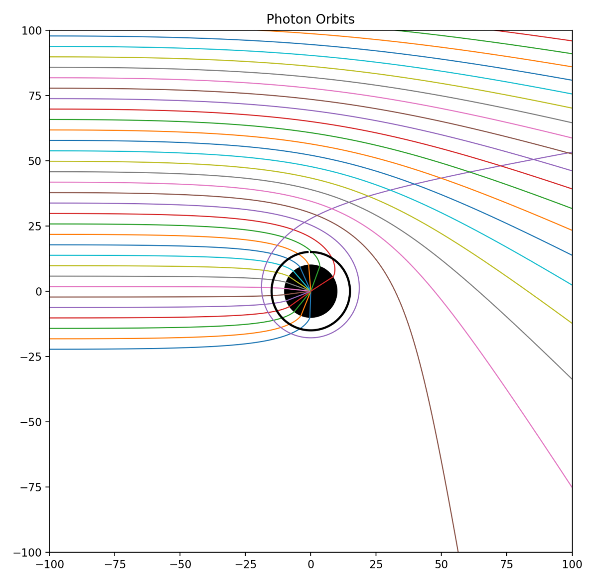

# Background

By day, I am a research scientist at the Met Office working in data assimilation
 and in my spare time I want to improve my own personal coding skills and create
 new projects that are fun to me. These will have a similar theme within 
astrophysics given my undergraduate and postgraduate degrees in astrophysics 
from the University of Hertfordshire (2023) and Cardiff University (2024).

## What is the black_holes repository?

**Black_holes** is a personal project where I try to code multiple light rays
passing by one and eventually multiple black holes in order to visualise clearly
how light bends through the fabric of space-time using Einstein, Schwarzschild 
and many other equations.

In the plots created from the _black_hole.py_ file, there are three components 
to the black hole:

1) The black hole itself, whereby the circumference is the event horizon - the 
boundary where if an event were to happen inside within this radius, it will not
 possible to escape beyond that sphere.
2) Next we have the photon sphere which is 1.5 times the radius of the event 
horizon, and at this radius, light travelling at 299,000 kilometers per second, 
will be in orbit due to the immense gravitational pull. However, this orbit is 
unstable, and so the photons will either spiral inwards towards to the 
singularity, or spiral outwards towards infinity.
3) Lastly, the black hole's 'shadow'. This is the region where if parallel rays 
of light were to travel towards the black hole, then light at 2.6 times the 
event horizon radii will just skim the photon sphere and then end tend to 
infinity.

With this project, I am wanting to replicate the plots, to a certain degree, as 
seen here from the blog by [**_Prof. David D. Nolte_**](https://galileo-unbound.blog/2019/07/29/orbiting-photons-around-a-black-hole/).

*The plot above shows a black hole and an array of photons that trace curved paths from an outsider's perspective.*

The paths that are traced by photons are null geodesics — paths that massless
 particles (such as light) take through the fabric of space-time in general 
relativity.

I want to be able to plot multiple paths of light coming from one side of the 
plot and interact with the black hole following the null geodesics to see how 
light behaves around black holes with different masses.

### Extras

Please feel free to get in touch with me via LinkedIn or by cloning the 
repository yourself and making a new branch with your own changes. Anything will
 be greatly appreciated and I encourage constructive criticism. After all, we 
are all still learning and I am eager to hear new ideas!